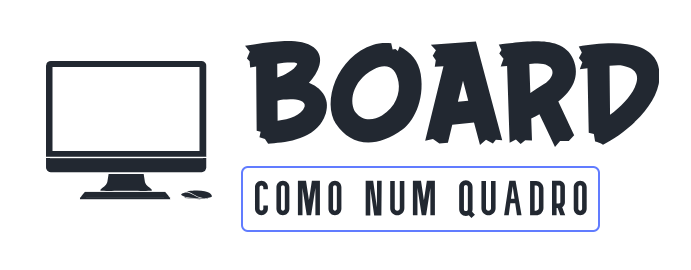

[Logo-Board-Task](public/logo-board.png)


# Board-Task

Uma aplicação de gerenciamento de projetos, que serve de base de teste para adesão a STATEMENT MC


## Descrição

Este projecto foi apresentado como teste de desenvolvimento. Descrito da seguinte maneira: Uma aplicação de gerenciamento de projetos com interface intuitiva e funcionalidades avançadas. A aplicação deve permitir aos usuários criar, organizar, colaborar e
monitorar o progresso de projetos de forma eficaz..

## Tabela de Conteúdos
- [Instalação](#instalação)
- [Uso](#uso)
- [Contribuição](#contribuição)
- [Licença](#licença)

## Instalação
Siga os passos abaixo para rodar o projeto localmente:

1. Clone este repositório:
   ```bash
   git clone https://github.com/aja-silason/board-task.git
2. Navegue até a pasta do projeto:
    ```bash
    cd board-task
3. Instale as dependências:
    ```bash
    npm install
4. Inicie o servidor:
    ```bash
    npm run board
## Uso

Após a instalação, abra seu navegador e acesse ``http://localhost:5173/`` para começar a usar a aplicação.

## Produção 

Poderá acessar a aplicação em produção pelo link:``em breve``

## Contribuição

As contribuições para esse projecto está em análise... 

## Licença

Este projeto está sob a Licença MIT<br>

E a engenharia é da inteira responsabilidade da **STETMENT MC**, qualquer forma de usar a aplicação entrar em contacto com:  [Anania Augusto](ananiasjaimeaugusto@gmail.com)

## Tecnologias

<br>

<br>

<br>

<br>

<br>

<br>

<br>

## Extra

### Logotipo

Criado no site Looka com a ajuda de IA interna

**Link do logotipo criado para usar no projecto:**

    https://looka.com/s/215817245

**Link da plataforma Looka**

    copie e cole no navegador: https://looka.com